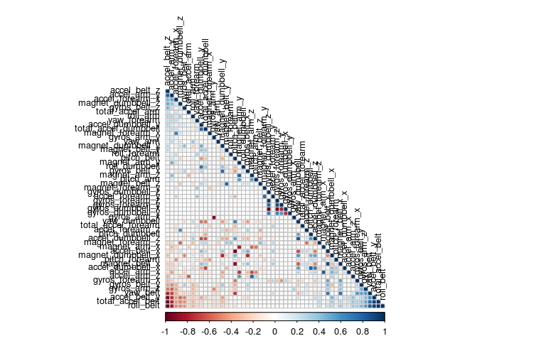
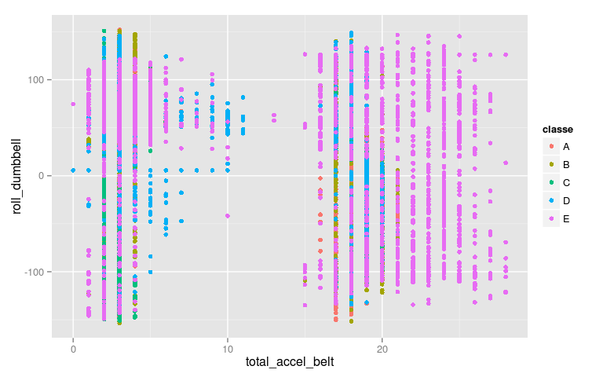
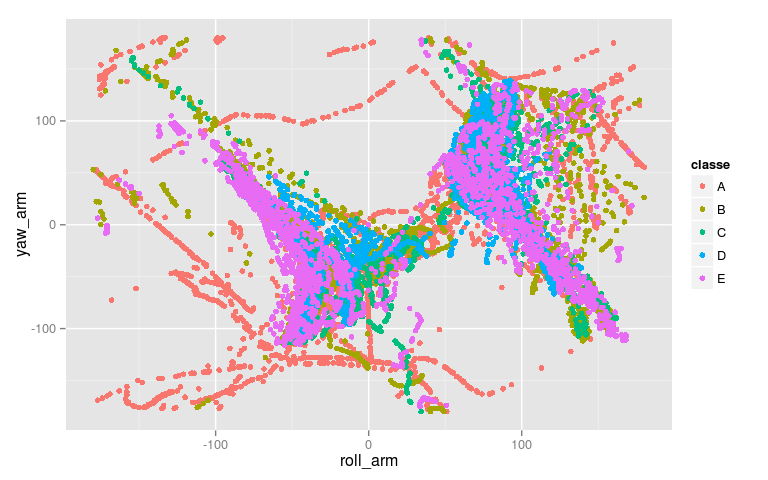
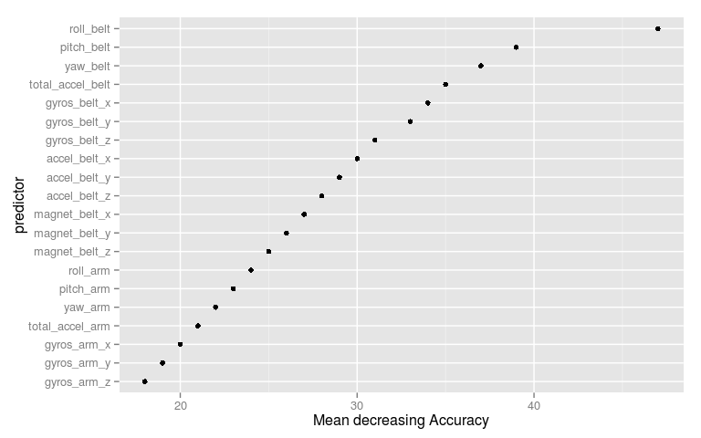

# Practical Machine Learning Course - Workout Prediction
R.Marrese  
12/2/2015  
***


## 1. Executive Summary
Using devices such as Jawbone Up, Nike FuelBand, and Fitbit it is now possible to collect a large amount of data about personal activity relatively inexpensively. These type of devices are part of the quantified self movement – a group of enthusiasts who take measurements about themselves regularly to improve their health, to find patterns in their behavior. This is part of Coursera MOOC course on Machine Learning (tought by JHU).
The goal of this report is to create a machine-learning algorithm that can correctly identify the quality of barbell bicep curls by using data from belt, forearm, arm, and dumbbell monitors. There are five classifications of this exercise, only one method is the correct form of the exercise, while the other four are common mistakes: 
* Class A - exactly according to the specification
* Class B - throwing the elbows to the front
* Class C - lifting the dumbbell only halfway
* Class D - lowering the dumbbell only halfway
* Class E - throwing the hips to the front.

More information is available from the website here: <http://groupware.les.inf.puc-rio.br/har> (see the section on the Weight Lifting Exercise Dataset).

The data is collected from accelerometers on the belt, forearm, arm, and dumbell of 6 participants. The outcome variable has five classes and the total number of predictors are 159.
The project has followed this steps:
* loading datasets from URL to a working directory
* simplify datasets (reducing number of predictors - from 159 to 53 and deleting useless data)
* divide training observation in 2 parts: `testing` and `crossvalidation`
* choose the adeguate model (random forest has been selected)
* testing the model oucome on the `testing` dataset
* evaluate model accuracy
* predict model outcome on real testing data (subsequent Project submission)

## 2. Libraries
The report is generated in`R by Rstudio Version 0.98.945` running on a server.
The following libraries were used throughout the code.


```r
library(caret)
library(kernlab)
library(randomForest)
library(corrplot)
library(ggplot2)
```

## 3. Data Loading and Preprocessing
### 3.1 Loading datasets


Two csv files (`training` and `test`)  were downloaded  on Fri Feb 13 10:25:41 2015 into data folder called `data` in the current working directory.

### 3.2. Preprocessing
The original `training` dataset contains 19622 rows and 160 columns. Prior to choose the prediction model, it seems that some preprocessing (i.e. simplifying/reducing dimension of dataset without affecting the prediction capability) is necessary.

```r
# clean the data by removing columns with NAs etc
NA_values <- apply(training_raw, 2, function(x) {sum(is.na(x))})
training_raw2 <- training_raw[,which(NA_values == 0), ]
# remove identifier columns such as name, timestamps, etc
training <- training_raw2[,8:length(training_raw2)]
rm(list=(c("training_raw","training_raw2"))) #remove useless dataframe to free space
dim(training)
```

```
## [1] 19622    53
```

The dataset `training` now contains a little as  53 columns and is ready to be submitted to a model.

## 4. Data splitting
The test data set was split up into training and cross validation sets in a 70:30 ratio in order to train the model.

```r
# split the cleaned testing data into training and cross validation
index <- createDataPartition(y = training$classe, p = 0.7, list = FALSE)
training <- training[index, ]
crossval <- training[-index, ]
```
A correlation matrix is then generated in order to have a picture of relationship between variables.

```r
# plot a correlation matrix
correlMatrix <- cor(training[, -length(training)]) #produce correlation matrix except variable classe 
corrplot(correlMatrix, order = "FPC", method = "circle", type = "lower", tl.cex = 0.8, tl.col = rgb(0, 0, 0)) #plot correlation
```

 

The darker the colour the stronger is the relation. As we can see the majority of matrix element are in ligth colour, leaving only a very few strong relation.

## 5. Running the prediction model
### 5.1 Model Selection
Having a quick look on dataset it seems that data are complex to the goal of grouping process so that a discrete rpart model may not yeld required accuracy. Following plots could explain the concept. 

  

For this reason it has been decided to run a **random forest** algorithm, which seems more appropriate to the data structure.

### 5.2 Model execution

The model run on the predicted variable `classe` taking other variables as predictors.

```r
model <- randomForest(classe ~ ., data = training)
model
```

```
## 
## Call:
##  randomForest(formula = classe ~ ., data = training) 
##                Type of random forest: classification
##                      Number of trees: 500
## No. of variables tried at each split: 7
## 
##         OOB estimate of  error rate: 0.55%
## Confusion matrix:
##      A    B    C    D    E  class.error
## A 3903    2    0    0    1 0.0007680492
## B   17 2635    6    0    0 0.0086531226
## C    0   13 2379    4    0 0.0070951586
## D    0    0   25 2226    1 0.0115452931
## E    0    0    2    4 2519 0.0023762376
```
The model produced a very small OOB error rate of .49%. This is considered satisfactory to proceed to the testing phase.

## 6. Crossvalidation
### 6.1 Predictors importance


```r
imp <- varImp(model)
modplot <- as.data.frame(cbind(predictor=row.names(imp),importance=imp[order(imp, decreasing=TRUE),])) #sort predictors
modplot$importance <- as.numeric(modplot$importance)
modplot$predictor <- factor(modplot$predictor, as.character(modplot$predictor))
modplot$predictor <- reorder(modplot$predictor, modplot$importance)
qplot(importance, predictor, data=modplot[1:20,], xlab="Mean decreasing Accuracy") #plot top 20 predictors
```

 

### 6.2 Crossvalidation

We used **holdout data split** method (instead proper cross validation). A classification of the remaining 30% of data (`crossval` dataset) has been carried out using the model. The results were placed in a confusion matrix along with the actual classifications in order to determine the accuracy of the model.


```r
predictCrossVal <- predict(model, crossval)
confusionMatrix(crossval$classe, predictCrossVal)
```

```
## Confusion Matrix and Statistics
## 
##           Reference
## Prediction    A    B    C    D    E
##          A 1166    0    0    0    0
##          B    0  817    0    0    0
##          C    0    0  694    0    0
##          D    0    0    0  687    0
##          E    0    0    0    0  790
## 
## Overall Statistics
##                                      
##                Accuracy : 1          
##                  95% CI : (0.9991, 1)
##     No Information Rate : 0.2807     
##     P-Value [Acc > NIR] : < 2.2e-16  
##                                      
##                   Kappa : 1          
##  Mcnemar's Test P-Value : NA         
## 
## Statistics by Class:
## 
##                      Class: A Class: B Class: C Class: D Class: E
## Sensitivity            1.0000   1.0000   1.0000   1.0000   1.0000
## Specificity            1.0000   1.0000   1.0000   1.0000   1.0000
## Pos Pred Value         1.0000   1.0000   1.0000   1.0000   1.0000
## Neg Pred Value         1.0000   1.0000   1.0000   1.0000   1.0000
## Prevalence             0.2807   0.1967   0.1671   0.1654   0.1902
## Detection Rate         0.2807   0.1967   0.1671   0.1654   0.1902
## Detection Prevalence   0.2807   0.1967   0.1671   0.1654   0.1902
## Balanced Accuracy      1.0000   1.0000   1.0000   1.0000   1.0000
```

This model yielded a 100% prediction accuracy, with 100% Sensitivity and Specificity, so this model proved very robust and adeguate to predict new data.

### 6.3 InSample and OutOfSample estimation

```r
## calculate OutOfSample estimation
trainFull <- rbind(training,crossval)
pred <- predict(model, trainFull)
outOfSampleAcc <- sum(pred == trainFull$classe)/length(pred)
paste0("Out of Sample Accuracy ", round(outOfSampleAcc,digits=2),"%")
```

```
## [1] "Out of Sample Accuracy 1%"
```

```r
paste0("Out of sample error estimation: ", round(((1-outOfSampleAcc)*100), digits=2), "%")
```

```
## [1] "Out of sample error estimation: 0%"
```
In sample error rate is 0% (1-Accuracy). Luckily the same is for Out Of Sample error estimation. Obvoulsy the Testing error rate would be grater than estimation, but stating previous results, there is not much concern about it.

## 7.Prediction process
### 7.1 Preprocess test dataset
So we applied the same cleaning treatment to the final testing data `test`, producing the same predictor of training dataset.

```r
test_raw <- read.csv("./data/pml-testing.csv", na.strings= c("NA",""," "))
NA_values <- apply(test_raw, 2, function(x) {sum(is.na(x))})
test_raw2 <- test_raw[,which(NA_values == 0)]
test <- test_raw2[8:length(test_raw2)]
dim (test)
```

```
## [1] 20 53
```

### 7.2 Prediction
The model was finally used to predict the classifications of the 20 results of data contained in loaded/preprocessed `test` dataset.

```r
predictTest <- predict(model, test)
predictTest
```

```
##  1  2  3  4  5  6  7  8  9 10 11 12 13 14 15 16 17 18 19 20 
##  B  A  B  A  A  E  D  B  A  A  B  C  B  A  E  E  A  B  B  B 
## Levels: A B C D E
```
Finally, for subsequent purposes (_project submission_), 20 text files have been generated as a set of prediction.


## 8. Conclusion
It became apparent that with information made available by measuring instrument it is possible to accurately predict the correctness of performing exercise using a **simple model** driven by a **few predictors**.

